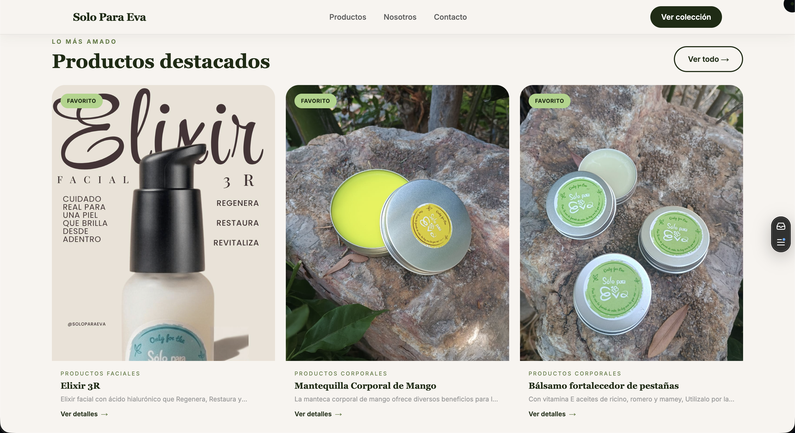

# Solo Para Eva - Tienda de Productos de Limpieza Corporal


## Descripción

**Solo Para Eva** es una plataforma de comercio electrónico especializada en productos artesanales para el cuidado personal y la limpieza corporal. Ofrece una amplia gama de productos naturales elaborados con ingredientes de alta calidad, libres de químicos dañinos, respetuosos con la piel y con el medio ambiente.

La aplicación está desarrollada con Next.js 15 y exportada como sitio estático, desplegada en Vercel con dominio personalizado.

## Características Principales

### Funcionalidades de E-commerce
- **Catálogo Completo**: Productos organizados por categorías (Capilares, Corporales, Faciales, SPA, Kits)
- **Sistema de Filtrado**: Filtros por categoría, precio y características
- **Carrito de Compras**: Gestión del carrito con persistencia
- **Páginas de Detalle**: Información detallada de cada producto con variantes y precios
- **Productos Relacionados**: Sugerencias basadas en categorías

### Diseño y UX
- **Diseño Responsive**: Optimizado para móviles, tablets y escritorio
- **Animaciones Fluidas**: Framer Motion + GSAP para animaciones avanzadas
- **Cursor Personalizado**: Componente `CustomCursor` para experiencia de escritorio
- **Secciones de Home**: HeroSection, BrandStory, BenefitsSection, FeaturedProducts, CtaSection, TestimonialsSection
- **Interfaz Moderna**: Componentes construidos con Radix UI y Tailwind CSS 4

### Panel de Administración
- **Gestión de Productos**: CRUD completo para productos y categorías
- **Configuración de Colores**: Personalización dinámica del esquema de colores
- **Dashboard Analytics**: Métricas y estadísticas del negocio
- **Importación Masiva**: Herramientas para importar datos de productos
- **Autenticación**: Login seguro con Firebase Auth

### SEO y Accesibilidad
- **Sitemap XML**: `/public/sitemap.xml` generado para indexación
- **Robots.txt**: `/public/robots.txt` configurado para crawlers
- **Metadata Dinámica**: Archivo `metadata.tsx` centralizado por página
- **Exportación Estática**: Salida como HTML/CSS/JS puro para máximo rendimiento




## Tecnologías Utilizadas

### Frontend
- **Next.js 15.2.4** - Framework React con exportación estática (`output: 'export'`)
- **React 19** - Biblioteca de interfaces de usuario
- **TypeScript 5** - Tipado estático
- **Tailwind CSS 4** - Framework CSS utilitario
- **Framer Motion 12** - Animaciones declarativas
- **GSAP 3.15** - Animaciones avanzadas y efectos de scroll

### UI Components
- **Radix UI** - Componentes primitivos accesibles (Dialog, Dropdown, Select, Switch, Tabs)
- **Lucide React** - Iconografía
- **Class Variance Authority** - Variantes de componentes
- **tw-animate-css** - Animaciones CSS para Tailwind

### Backend & Base de Datos
- **Firebase 11.7.3** - Backend as a Service
- **Firestore** - Base de datos NoSQL en tiempo real
- **Firebase Auth** - Autenticación de administradores

### Herramientas de Desarrollo
- **ESLint 9** - Linting
- **PostCSS** - Procesador CSS
- **Turbopack** - Bundler para desarrollo rápido

### Hosting y Dominio
- **Vercel** - Despliegue y hosting
- **soloparaeva.lat** - Dominio personalizado

## Requisitos del Sistema

- **Node.js** 18.x o superior
- **npm** o **yarn**
- Cuenta de **Firebase**

## Instalación y Configuración

### 1. Clonar el Repositorio
```bash
git clone https://github.com/Aaron3312/tienda-limpieza-corporal.git
cd tienda-limpieza-corporal
```

### 2. Instalar Dependencias
```bash
npm install
```

### 3. Configurar Variables de Entorno
Crear `.env.local` en la raíz:
```env
# Firebase
NEXT_PUBLIC_FIREBASE_API_KEY=your_api_key
NEXT_PUBLIC_FIREBASE_AUTH_DOMAIN=your_auth_domain
NEXT_PUBLIC_FIREBASE_PROJECT_ID=your_project_id
NEXT_PUBLIC_FIREBASE_STORAGE_BUCKET=your_storage_bucket
NEXT_PUBLIC_FIREBASE_MESSAGING_SENDER_ID=your_messaging_sender_id
NEXT_PUBLIC_FIREBASE_APP_ID=your_app_id

# Dominio personalizado (omite basePath/assetPrefix si es true)
CUSTOM_DOMAIN=true

NEXT_PUBLIC_SITE_URL=https://soloparaeva.lat
```

### 4. Ejecutar en Desarrollo
```bash
npm run dev
```

Disponible en [http://localhost:3000](http://localhost:3000)

## Estructura del Proyecto

```
tienda-limpieza-corporal/
├── src/
│   ├── app/                        # App Router de Next.js
│   │   ├── admin/                  # Panel de administración
│   │   │   ├── colores/
│   │   │   ├── configuracion/
│   │   │   ├── dashboard/
│   │   │   ├── import/
│   │   │   ├── login/
│   │   │   └── productos/
│   │   ├── carrito/
│   │   ├── contacto/
│   │   ├── nosotros/
│   │   ├── productos/
│   │   │   ├── [productId]/        # Detalle de producto dinámico
│   │   │   └── categorias/
│   │   ├── layout.tsx              # Layout raíz
│   │   ├── metadata.tsx            # Metadata centralizada
│   │   └── providers.tsx           # Context providers globales
│   ├── components/
│   │   ├── admin/
│   │   ├── contacto/
│   │   ├── home/                   # Secciones de la página principal
│   │   │   ├── BenefitsSection.tsx
│   │   │   ├── BrandStory.tsx
│   │   │   ├── CtaSection.tsx
│   │   │   ├── CustomCursor.tsx
│   │   │   ├── FeaturedProducts.tsx
│   │   │   ├── HeroSection.tsx
│   │   │   └── TestimonialsSection.tsx
│   │   ├── layout/                 # Header, Footer, LayoutClient
│   │   ├── nosotros/
│   │   ├── productDetails/
│   │   ├── productos/
│   │   ├── testimonios/
│   │   └── ui/                     # Componentes base (shadcn/ui)
│   ├── context/
│   ├── data/                       # Datos estáticos JSON
│   ├── lib/
│   ├── services/                   # Servicios de Firebase
│   ├── types/
│   └── utils/
├── public/
│   ├── images/
│   ├── robots.txt
│   └── sitemap.xml
├── next.config.ts
├── tailwind.config.js
└── tsconfig.json
```

## Scripts Disponibles

```bash
npm run dev       # Desarrollo con Turbopack
npm run build     # Build para producción (genera /out)
npm start         # Servidor de producción
npm run lint      # Linting
```

## Despliegue

### Vercel (producción)
El proyecto usa `output: 'export'` en `next.config.ts`, generando una carpeta `/out` con archivos estáticos puros.

```bash
npm run build     # Genera /out
```

Vercel detecta automáticamente la configuración de Next.js. La variable `CUSTOM_DOMAIN=true` elimina el `basePath` para el dominio personalizado.

### Configuración de Firebase
1. Crear proyecto en [Firebase Console](https://console.firebase.google.com/)
2. Habilitar Firestore y Firebase Auth
3. Agregar credenciales a `.env.local`

## Seguridad

- **Firebase Auth**: Login protegido para panel admin
- **Firestore Rules**: Control de acceso a datos
- **Variables de Entorno**: Credenciales fuera del código fuente

## Categorías de Productos

1. **Capilares**: Jabones y shampoos sólidos naturales
2. **Corporales**: Jabones artesanales, exfoliantes, cremas
3. **Faciales**: Cremas hidratantes, exfoliantes, bálsamos
4. **SPA**: Bombas efervescentes, sales aromáticas
5. **Kits**: Combos especiales y regalos personalizados

## Soporte y Contacto

- **Desarrollador**: Aaron Hernández Jiménez
- **Email**: contacto@acsoftwarelabs.com
- **Sitio Web**: [soloparaeva.com](https://soloparaeva.com)

## Licencia

Todos los derechos reservados © Solo Para Eva 2025.
