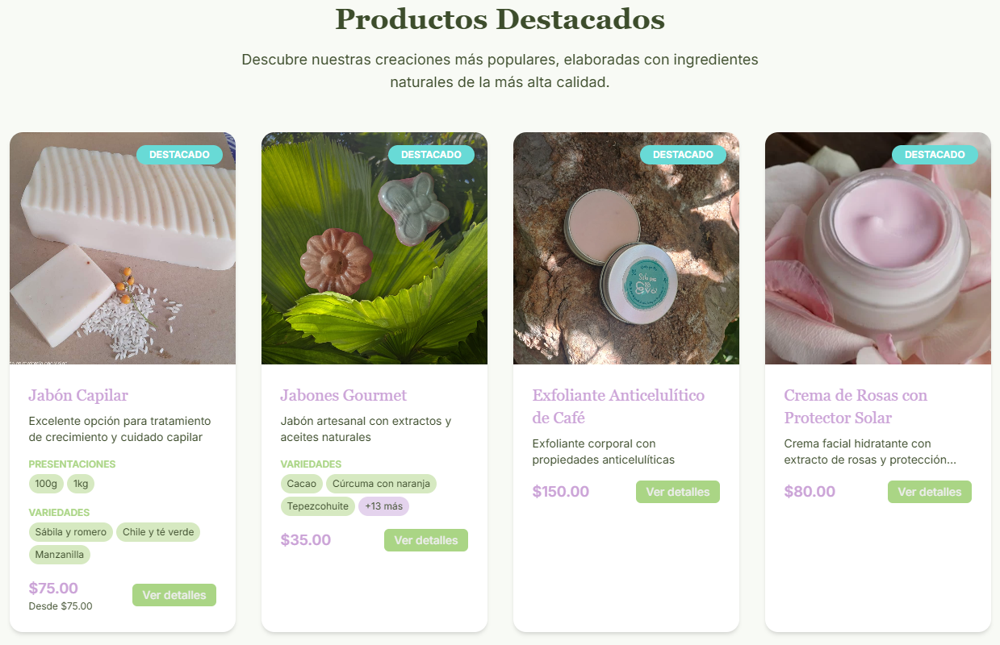
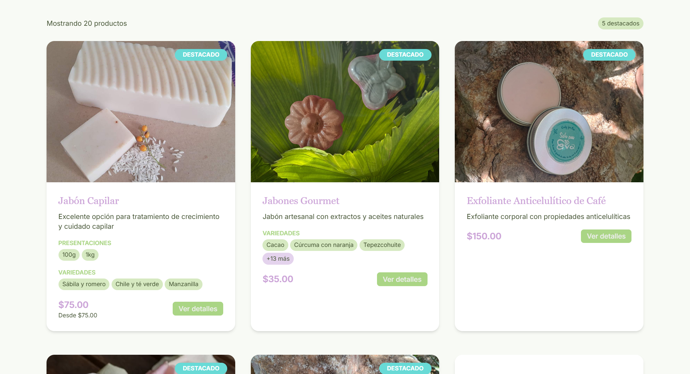
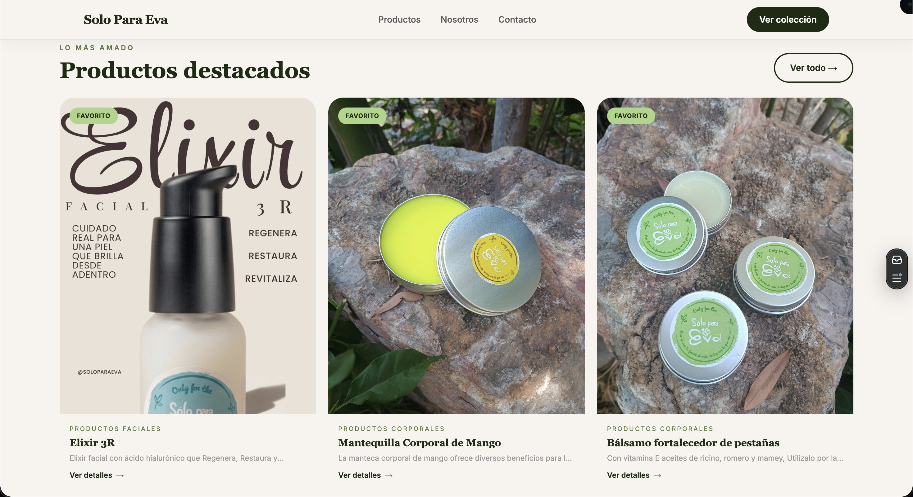
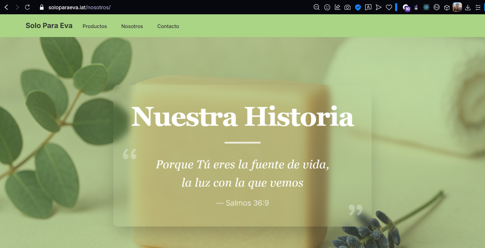

# Solo Para Eva - Tienda de Productos de Limpieza Corporal

## Vista Previa — Rediseño 2026

### Antes → Ahora

| Antes | Ahora |
|-------|-------|
|  |  |
|  |  |
|  |  |

## Descripción

**Solo Para Eva** es una plataforma de comercio electrónico especializada en productos artesanales para el cuidado personal y la limpieza corporal. Ofrece una amplia gama de productos naturales elaborados con ingredientes de alta calidad, libres de químicos dañinos, respetuosos con la piel y con el medio ambiente.

La aplicación está desarrollada con Next.js 15 (App Router) y desplegada en Vercel con dominio personalizado. El checkout se hace con Stripe y los pedidos se guardan en Firestore mediante route handlers de servidor.

## Características Principales

### Funcionalidades de E-commerce
- **Catálogo Completo**: Productos organizados por categorías (Capilares, Corporales, Faciales, SPA, Kits)
- **Sistema de Filtrado**: Filtros por categoría, precio y características
- **Carrito de Compras**: Gestión del carrito con persistencia
- **Checkout con Stripe**: Sesión de pago alojada por Stripe y webhook que confirma el pedido
- **Correos de Pedido**: Notificaciones con Resend al cliente y a la tienda
- **Cuentas de Clientas**: Acceso con Google, historial de pedidos y seguimiento de envío en `/cuenta`
- **Compra como invitada**: La cuenta es opcional; la confirmación llega por correo igual
- **Páginas de Detalle**: Información detallada de cada producto con variantes y precios
- **Productos Relacionados**: Sugerencias basadas en categorías

### Diseño y UX
- **Diseño Responsive**: Optimizado para móviles, tablets y escritorio
- **Animaciones Fluidas**: Framer Motion + GSAP para animaciones avanzadas
- **Cursor Personalizado**: Componente `CustomCursor` para experiencia de escritorio
- **Secciones de Home**: HeroSection, BrandStory, BenefitsSection, FeaturedProducts, CtaSection, TestimonialsSection
- **Interfaz Moderna**: Componentes construidos con Radix UI y Tailwind CSS 4

### Panel de Administración
- **Gestión de Productos**: CRUD completo para productos y categorías
- **Configuración de Colores**: Personalización dinámica del esquema de colores
- **Dashboard Analytics**: Métricas y estadísticas del negocio
- **Pedidos**: Seguimiento por estado (pagado, en preparación, enviado, entregado, cancelado), paquetería y guía; aviso por correo al enviar
- **Resumen**: Ventas del mes, pedidos por atender, ticket promedio y más vendidos
- **Rol de administradora**: Custom claim `admin` en Firebase Auth; se gestiona con `npm run admin`
- **Importación Masiva**: Herramientas para importar datos de productos
- **Autenticación**: Google o correo/contraseña con Firebase Auth; sólo cuentas con el claim `admin` entran al panel

### SEO y Accesibilidad
- **Sitemap XML**: `/public/sitemap.xml` generado para indexación
- **Robots.txt**: `/public/robots.txt` configurado para crawlers
- **Metadata**: Definida en `layout.tsx` y en las páginas dinámicas de producto

## Tecnologías Utilizadas

### Frontend
- **Next.js 15** - App Router con route handlers para checkout, webhook y pedidos
- **React 19** - Biblioteca de interfaces de usuario
- **TypeScript 5** - Tipado estático
- **Tailwind CSS 4** - Framework CSS utilitario
- **Framer Motion 12** - Animaciones declarativas
- **GSAP 3.15** - Animaciones avanzadas y efectos de scroll

### UI Components
- **Radix UI** - Componentes primitivos accesibles (Dialog, Dropdown, Select, Switch, Tabs)
- **Lucide React** - Iconografía
- **Class Variance Authority** - Variantes de componentes
- **tw-animate-css** - Animaciones CSS para Tailwind

### Backend & Base de Datos
- **Firebase 11.7.3** - Backend as a Service
- **Firestore** - Base de datos NoSQL en tiempo real
- **Firebase Auth** - Autenticación de administradores
- **Firebase Admin** - Escritura de pedidos desde el servidor
- **Stripe** - Pasarela de pago (Checkout alojado + webhook)
- **Resend** - Envío de correos transaccionales

### Herramientas de Desarrollo
- **ESLint 9** - Linting
- **PostCSS** - Procesador CSS
- **Turbopack** - Bundler para desarrollo rápido

### Hosting y Dominio
- **Vercel** - Despliegue y hosting
- **soloparaeva.lat** - Dominio personalizado

## Requisitos del Sistema

- **Node.js** 18.x o superior
- **npm** o **yarn**
- Cuenta de **Firebase**
- Cuenta de **Stripe** (modo prueba sirve) y opcionalmente **Resend**

## Instalación y Configuración

### 1. Clonar el Repositorio
```bash
git clone https://github.com/Aaron3312/tienda-limpieza-corporal.git
cd tienda-limpieza-corporal
```

### 2. Instalar Dependencias
```bash
npm install
```

### 3. Configurar Variables de Entorno
Crear `.env.local` en la raíz:
```env
# Firebase
NEXT_PUBLIC_FIREBASE_API_KEY=your_api_key
NEXT_PUBLIC_FIREBASE_AUTH_DOMAIN=your_auth_domain
NEXT_PUBLIC_FIREBASE_PROJECT_ID=your_project_id
NEXT_PUBLIC_FIREBASE_STORAGE_BUCKET=your_storage_bucket
NEXT_PUBLIC_FIREBASE_MESSAGING_SENDER_ID=your_messaging_sender_id
NEXT_PUBLIC_FIREBASE_APP_ID=your_app_id

# Base para URLs absolutas de Stripe (en Vercel, la URL del deploy)
NEXT_PUBLIC_SITE_URL=http://localhost:3000

# Firebase Admin (webhook y panel de pedidos). En local basta la ruta al JSON
# de la cuenta de servicio; en Vercel usa FIREBASE_SERVICE_ACCOUNT con el JSON.
GOOGLE_APPLICATION_CREDENTIALS=./ruta-a-service-account.json
# FIREBASE_SERVICE_ACCOUNT=

# Stripe (sin STRIPE_SECRET_KEY el pago corre en modo simulado)
STRIPE_SECRET_KEY=sk_test_...
STRIPE_WEBHOOK_SECRET=whsec_...   # lo imprime `stripe listen`

# Resend (sin clave no se envían correos, pero el pedido sí se crea)
RESEND_API_KEY=
RESEND_FROM=
CORREO_NOTIFICACIONES=
```

El JSON de la cuenta de servicio está ignorado por git (`*-firebase-adminsdk-*.json`). No lo subas nunca.

### 4. Ejecutar en Desarrollo
```bash
npm run dev
```

Disponible en [http://localhost:3000](http://localhost:3000)

## Estructura del Proyecto

```
tienda-limpieza-corporal/
├── src/
│   ├── app/                        # App Router de Next.js
│   │   ├── admin/                  # Panel de administración
│   │   │   ├── colores/
│   │   │   ├── configuracion/
│   │   │   ├── dashboard/
│   │   │   ├── import/
│   │   │   ├── login/
│   │   │   └── productos/
│   │   ├── api/
│   │   │   ├── checkout/           # Crea la sesión de Stripe
│   │   │   ├── webhooks/stripe/    # Confirma el pedido
│   │   │   └── admin/pedidos/      # Lista pedidos (admin)
│   │   ├── carrito/
│   │   ├── contacto/
│   │   ├── cuenta/                 # Cuenta de clienta: acceso con Google y pedidos
│   │   ├── nosotros/
│   │   ├── productos/
│   │   │   ├── [productId]/        # Detalle de producto dinámico
│   │   │   └── categorias/
│   │   ├── layout.tsx              # Layout raíz
│   │   └── providers.tsx           # Context providers globales
│   ├── components/
│   │   ├── admin/
│   │   ├── home/                   # Secciones de la página principal
│   │   │   ├── BenefitsSection.tsx
│   │   │   ├── BrandStory.tsx
│   │   │   ├── CtaSection.tsx
│   │   │   ├── CustomCursor.tsx
│   │   │   ├── FeaturedProducts.tsx
│   │   │   ├── HeroSection.tsx
│   │   │   └── TestimonialsSection.tsx
│   │   ├── layout/                 # Header, Footer, LayoutClient
│   │   ├── productos/
│   │   └── ui/                     # Componentes base (shadcn/ui)
│   ├── context/
│   ├── data/                       # Datos estáticos JSON
│   ├── lib/                        # firebase, firebaseAdmin, comercio, correos
│   ├── services/                   # Servicios de Firebase
│   └── types/
├── public/
│   ├── images/
│   ├── robots.txt
│   └── sitemap.xml
├── scripts/                        # admin.mjs (roles), configurar-produccion.sh
├── docs/                           # Screenshots del README y pendientes
├── firestore.rules
├── storage.rules
├── next.config.ts
└── tsconfig.json
```

## Scripts Disponibles

```bash
npm run dev       # Desarrollo con Turbopack
npm run build     # Build para producción
npm start         # Servidor de producción
npm run lint      # Linting

npm run admin -- list                 # Quiénes administran el panel
npm run admin -- grant correo@x.com   # Dar rol admin (crea la cuenta si no existe)
npm run admin -- revoke correo@x.com  # Quitar rol admin

bash scripts/configurar-produccion.sh # Webhook de Stripe + variables en Vercel
```

### Probar el pago en local

```bash
npm run dev
stripe listen --forward-to localhost:3000/api/webhooks/stripe   # copia el whsec_ a STRIPE_WEBHOOK_SECRET
```

Paga con la tarjeta de prueba `4242 4242 4242 4242`, cualquier fecha futura y CVC. El webhook crea el pedido, la página de éxito lo confirma y aparece en `/admin/pedidos` (y en `/cuenta` si la compra se hizo con sesión).

## Despliegue

### Vercel (producción)
El proyecto necesita el runtime de servidor de Vercel (los route handlers de Stripe no funcionan con exportación estática). Vercel detecta la configuración de Next.js automáticamente.

1. `bash scripts/configurar-produccion.sh` registra el webhook `https://www.soloparaeva.com/api/webhooks/stripe` en Stripe y sube `STRIPE_SECRET_KEY` y `STRIPE_WEBHOOK_SECRET` a Vercel.
2. Despliega (`vercel --prod` o merge a `master`).
3. Para cobrar de verdad: activa la cuenta de Stripe y cambia la llave `sk_test_` por `sk_live_` en Vercel (y vuelve a correr el script para el webhook en modo live).

Los despliegues de preview no reciben webhooks porque su URL cambia; ahí la página de éxito se queda en "registrando pedido".

### Firebase Authentication
- Proveedores habilitados: Google y correo/contraseña.
- Dominios autorizados: soloparaeva.com, www.soloparaeva.com, soloparaeva.lat y solo-para-eva.vercel.app. Si cambias de dominio, agrégalo en Authentication → Settings → Authorized domains o la ventana de Google falla con `auth/unauthorized-domain`.

### Reglas de Firestore y Storage
Las reglas viven en `firestore.rules` y `storage.rules`; se despliegan con `firebase deploy --only firestore:rules,storage`.

### Configuración de Firebase
1. Crear proyecto en [Firebase Console](https://console.firebase.google.com/)
2. Habilitar Firestore y Firebase Auth
3. Agregar credenciales a `.env.local`

## Seguridad

- **Rol admin por custom claim**: una clienta con sesión de Google no puede escribir catálogo ni leer pedidos ajenos (`firestore.rules`, `storage.rules` y route handlers lo exigen)
- **Pedidos sólo desde el servidor**: los crea el webhook de Stripe con firma verificada; el navegador nunca manda precios, sólo ids y cantidades
- **Cada clienta lee sólo sus pedidos** (`where uid == auth.uid`)
- **Variables de Entorno**: credenciales fuera del código fuente; el JSON de la cuenta de servicio está ignorado por git

## Categorías de Productos

1. **Capilares**: Jabones y shampoos sólidos naturales
2. **Corporales**: Jabones artesanales, exfoliantes, cremas
3. **Faciales**: Cremas hidratantes, exfoliantes, bálsamos
4. **SPA**: Bombas efervescentes, sales aromáticas
5. **Kits**: Combos especiales y regalos personalizados

## Soporte y Contacto

- **Desarrollador**: Aaron Hernández Jiménez
- **Email**: contacto@acsoftwarelabs.com
- **Sitio Web**: [aaronhernandez.me](https://aaronhernandez.me)

## Licencia

Todos los derechos reservados © Solo Para Eva 2025.
